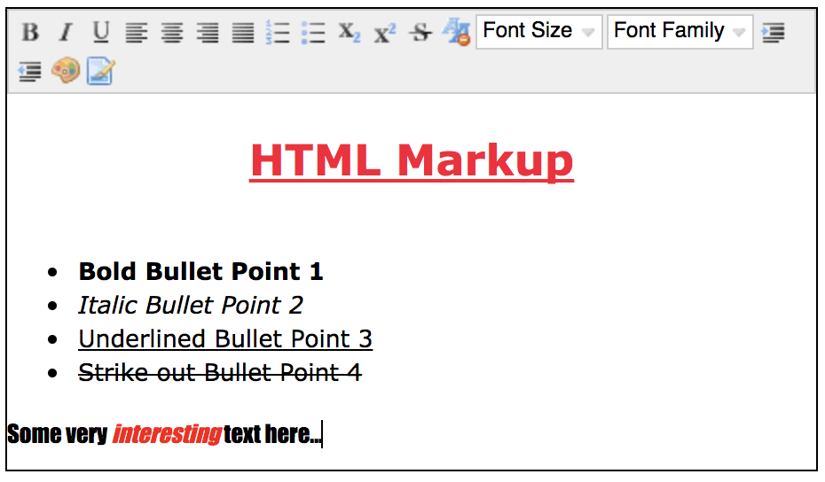

# omnis-legacy-rich-text
The JS Rich Text Editor from Studio 6.1.x re-implemented as a JSON-defined control for Studio 8.1.x.

Omnis Studio 8.0 included a rewrite of the JS Rich Text Editor control, to base it on [Quill JS](https://github.com/quilljs/quill).
This repository provides a JSON-defined control which implements the original Rich Text Editor from Studio 6.x (based on [NicEdit](http://nicedit.com)), which can then be used in Studio 8.1 and later.

<p align="center">
 
</p>

## Contents

This repository includes the following:

### net.omnis.legacyrichtext
A folder containing the JSON definition file control.json as generated by the JSON Control Editor available from the Omnis Studio Add-Ons menu together with images used by the Omnis Studio component store and design environment.

### ctl_net_omnis_legacyrichtext.js
The Javascript file used by Omnis Studio to create the client implementation of the Rich Text Editor.


### example/JSRICHTEXT_LEGACY
A folder containing an Omnis Studio library exported as JSON to demonstrate the Rich Text Editor component.

## Installation
1. Ensure Omnis Studio is closed.
2. Place the folder **net.omnis.legacyrichtext** into the */html/controls* (not /htmlcontrols) of your Omnis Studio tree, first creating the folder if it does not already exist.
3. Copy **ctl_net_omnis_legacyrichtext.js** into */html/scripts* of your Omnis Studio tree.
4. Add the following lines to your **/html/jsctempl.htm** file under the Omnis Studio JavaScript client scripts comment: 
```javascript
 <script type="text/javascript" src="scripts/ctl_net_omnis_legacyrichtext.js"></script>
```
5. Start Omnis Studio.
6. The control should now be accessible from the Component Store's 'JSON Components' tab for JS Remote Form classes.
**To open the example library:**
7. With the libraries node selected in the Studio Browser, press the New Lib from JSON hyperlink, set the JSON Tree Path to the **example/JSRICHTEXT_LEGACY** folder (containing demo library exported as JSON) and select a location for your new library.
8.	Press Import and the demo library should be ready to use.
